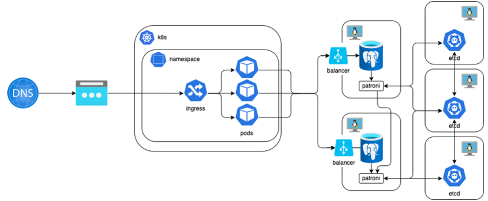

# Сервис прогноза погоды 

**Задачи**

**Инфраструктура** 
- [X] Написать ansible playbook для развертывания postgresql в patroni сетапе.
    Разворачиваем etcd, patroni, postgres и Haproxy.
- [X] Написать helm chart для разворачивания api в выделенном неймспейсе. Docker image лежит в публичном registry, разворачивать стоит актуальную версию ghcr.io/ldest/sre-course/api

- [X] Из образа вытащить скрипт миграции для создания БД, настроить на работу с кластером api, проверить работоспособность

**Мониторинг** 
- [X] Развернуть Prometheus на виртуальной машине
- [X] Установить Docker-compose для запуска экспортеров PostgreSQL и Patroni
- [ ] Настроить сбор метрик с PostgreSQL
- [ ] Настроить сбор метрик с Patroni
- [X] Настроить сбор метрик с etcd
- [X] Настроить сбор black box мониторинг API демоприложения
- [X] Настроить сбор метрик ОС с виртуальных машин
- [X] Создать в Grafana в организации Main Org:
- [X] Каталог для дашбордов со своим ФИ латиницей
- [X] Источник данных для своего Prometheus(в названии ФИ латиницей)
- [ ] Создать в своем каталоге типовые дашборды для компонент из п2-п4
- [X] Создать в своем каталоге дашборд с 4 золотыми сигналами для API демоприложения по данным метрик ingressk8s
- [X] Настроить в Prometheus алерты на 4 золотых сигнала мониторинга
- [ ] Рефакторинг
- [ ] Документация

# Порядок развертывания. 
1. FAQ лежит в папке docs
2. Настраиваем Postgres кластер. Переходим в my_postgresql_cluster. Читаем README.md
3. Запускам приложение в k8s. Переходим в k8s. Читаем README.md

В postgresql_cluster.txt полезные команды для работы с postgresql в patroni сетапе